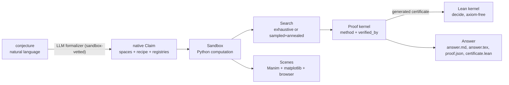

# SimAgent

[](https://github.com/Muchmirul/SimAgent/actions/workflows/ci.yml)

**Play with conjectures in a sandbox instead of fighting equations.**

Working on math purely through equations is intimidating and bottlenecked —
especially proving things. But many problems (geometric ones most of all) are
*visualizable*: you can build a world, poke it, and watch what happens. SimAgent
is a harness built on that idea:

> **Input:** a conjecture.
> **Middle:** an executable 3D sandbox simulation of the conjecture, visualized
> (Manim + matplotlib), with an automated search playing in it.
> **Output:** a mathematical answer: a certified counterexample, a witness, a
> kernel-checked proof, or honest evidence, written up in LaTeX and sketched in
> Lean. Equations are the *representation* of what happened in the sandbox, not
> the medium of work.

SimAgent is a small, correctness-first **agent harness**, and the word harness
is the whole design: **it answers nothing.** Every answer comes from the model
pi routes. The harness samples, anneals, enumerates, certifies in exact
fractions, generates Lean and draws the configuration, because all of that is
execution. Which claim to attack, which configuration to try, which of the ten
methods and what the picture means belong to the model. The Lean kernel is the
sole authority on deduction. Three pillars: **Python** computes,
**Lean** formulates and verifies, **Manim** visualizes. See
[ARCHITECTURE.md](ARCHITECTURE.md).

**Never seen this project?** Start at [docs/onboarding/](docs/onboarding/) — six
short pages that assume no knowledge of the codebase, of Lean, or of proof
assistants, and walk from one worked example to your first run. This README is
the summary; that folder is the explanation.


```mermaid
flowchart LR
    A["conjecture<br/>natural language"] -->|"LLM formalizer (sandbox-vetted)"| B["native Claim<br/>spaces + recipe + registries"]
    B --> C["Sandbox<br/>Python computation"]
    C --> D["Search<br/>exhaustive or sampled+annealed"]
    D --> E["Proof kernel<br/>method + verified_by"]
    E -->|"generated certificate"| L["Lean kernel<br/>decide, axiom-free"]
    C --> F["Scenes<br/>Manim + matplotlib + browser"]
    E --> G["Answer<br/>answer.md, answer.tex, proof.json, certificate.lean"]
```

## Proofs, by method

Every answer names one of the ten classical proof methods and carries a
`verified_by` stamp only the proof kernel may assign:

| method | verified by |
|---|---|
| **counterexample** | harness (exact rationals) **+ Lean kernel** (generated certificate, axiom-free) |
| **construction** | same machinery, for existence witnesses |
| **exhaustion** | every case of a finite integer domain checked **+ Lean `decide`** |
| direct, contradiction, contrapositive, induction, cases, combinatorial, infinite descent | **Lean only** — the harness never grades prose; an LLM attempt without kernel-accepted Lean is recorded as `verified_by: none` |

Sampling evidence ("no counterexample in N trials") is never called a proof.

## Quickstart (no API key needed)

```bash
uv venv .venv && uv pip install -p .venv/bin/python -e ".[dev]"
.venv/bin/simagent list
.venv/bin/simagent solve circumcenter-in-tetrahedron --trials 2000
```

Eleven conjectures are bundled and run fully offline. Each is a known-answer
test for the whole machine (`simagent bench` scores 11/11), and all are
**native claims** (a closed vocabulary of spaces, construction recipes and
registry measures — no generated code is ever exec'd):

| id | truth | method the harness reaches |
|---|---|---|
| `circumcenter-in-triangle` | false | **counterexample**, `sandbox+lean` |
| `circumcenter-in-tetrahedron` | false | **counterexample**, `sandbox+lean` |
| `circumcenter-in-4simplex` (ℝ⁴!) | false | **counterexample**, `sandbox` — no Lean above d=3, stated explicitly |
| `orthocenter-in-triangle` | false | **counterexample**, `sandbox+lean` — margin over a DERIVED entity; the recipe hook pins the construction |
| `sum-of-squares-vs-linear` | false | **counterexample**, `sandbox+lean` |
| `graph-triangle-threshold` | false | **counterexample**, `sandbox` — `GraphSpace`, no Lean hook yet |
| `sum-of-odds-square` | true (bounded) | **exhaustion** — all 201 cases + Lean `decide` |
| `positive-quadratic` | true | **direct** (sum of squares), `sandbox+lean` |
| `conditional-cubic` | true (for x ≥ 0) | **direct**, `sandbox+lean` |
| `unbounded-quadratic` | true | **direct**, `sandbox+lean` |
| `euler-characteristic-hull` | true | no proof — *evidence only*, and it says so |

The ℝ⁴ entry is the point: the core is dimension-agnostic. Dimension enters
only at the boundaries (the Space a claim lives in, the View that renders
it); everything between — search, exact certification, the proof kernel — is
dimension-blind.

A run directory contains the whole story:

```
runs/<id>-seed0/
  spec.json        the conjecture as a native claim (claim/1 JSON)
  intake.json      the problem contract: your words, the claim hash, the review state
  report.json      search report (verdict, witness, margins, certification)
  proof.json       the proof record, including the verified_by stamp
  scene.json       3D scene graph of the decisive configuration
  preview.png      matplotlib 3D render (always)
  scene_manim.py   self-contained Manim ThreeDScene (render any time)
  answer.md        readable verdict + witness + method
  answer.tex       classical LaTeX write-up
  certificate.lean the generated Lean the kernel accepted (only when one was made)
  conjecture.lean  Lean 4 / Mathlib skeleton (flagged unchecked)
```

Example verdict from the tetrahedron run — note the witness is *exact*:

> **DISPROVED — certified counterexample (exact rational arithmetic)**
> `T = (−1, −7/11, 8/11), (1/5, −1, −1/6), (−1/16, −9/11, 9/16), (−13/14, −4/15, 1/16)`

## The reasoning notebook (recommended)

```bash
(cd agent && npm ci --ignore-scripts && npm run build)
.venv/bin/simagent
```

Opens `http://localhost:8642` — a Jupyter-style notebook whose output is not
text but the agent's **visual chain of thought**:

- **In [ ]:** the problem — pick a bundled conjecture or type one in plain
  words (free text is formalized by a pi-routed model into a sandbox-validated spec).
- Press **Run agent**: an embodied agent session starts server-side, and one
  cell streams in per reasoning step — the model's *thinking*, the *act* it
  chose (`set_var`, `hunt`, `certify`, …), the **picture** of the scene after
  the act, the harness's **equation translation** of that state, and a
  **diff** vs the previous step with the margin change.
- Each cell shows the scene rendered for the human notebook. In an `--images`
  run, pictures returned by `look`, `view`, and `imagine` are also attached to
  the model. Click any cell image to open that step as an **interactive 3D
  scene** (three.js, orbit/zoom).
- The final **verdict cell** is built only from kernel artifacts
  (`proof.json`, `answer.md`) — the model's prose never upgrades a claim.
- The header dropdown replays any past run (CLI `simagent agent` runs
  included), and follows a still-running one live.
- **continue** carries a finished run on rather than starting over: its journal
  is replayed into a new session, every state hash checked, and the world
  re-opened. It is live only for a run that kept the journal and spec that
  needs, and it takes no problem of its own, since the claim comes from the run
  being continued.

The server remains the kernel authority: the sandbox session API
(`/api/load`, `/api/set`, `/api/hunt`, `/api/certify`, …) and Manim render
jobs are still there for scripts and tests; the notebook is a renderer over
kernel state.

### Manim without sudo

Manim needs system cairo/pango, which pip can't provide. The no-root route is
a conda-forge env (prebuilt binaries) via micromamba:

```bash
curl -Ls https://micro.mamba.pm/api/micromamba/linux-64/latest | tar -xj -C ~/.local bin/micromamba
~/.local/bin/micromamba create -y -p ./.manim-env -c conda-forge python=3.12 manim ffmpeg
```

SimAgent auto-detects `./.manim-env` (or set `SIMAGENT_MANIM_PYTHON`). With
sudo, `apt install libcairo2-dev libpango1.0-dev pkg-config python3-dev ffmpeg`
plus `pip install -e ".[viz]"` works too.

## Terminal play (no browser)

```bash
.venv/bin/simagent play circumcenter-in-tetrahedron
```

Opens a REPL on the conjecture's sandbox. **Keep `runs/play-<id>/preview.png`
open in your editor** — it re-renders after every command, so the 3D view
updates live while you type (VS Code reloads changed images automatically).

```
(sandbox) nudge T[3] 0 0 -0.5      # flatten the tetrahedron by hand
  status: holds=True  margin=+0.0812
(sandbox) refine                   # let the annealer push it over the edge
  status: holds=False margin=-0.4310
(sandbox) certify                  # exact-rational verdict for what's on screen
CERTIFIED in exact rationals: property FAILS for this configuration
(sandbox) hunt 2000                # or let the machine search from scratch
(sandbox) manim                    # cinematic render of the current state
```

Human and machine share the same moves: you `set`/`nudge` points by hand, the
harness `hunt`s/`refine`s, and `certify` turns whatever is on screen into an
exact verdict. `help` lists everything.

## Agent mode: the LLM lives in the sandbox

Pi owns the model loop, provider authentication, steering, events, and
conversation branches. Python still owns every world action, exact check,
Lean check, and verdict. The model reads the world in exact numbers (`check`
gives its coordinates, whether the claim holds, and the margin; `measure` gives
the qualitative description) and acts only through the closed SimAgent tool
set: `plan`, `measure`, `view`, `imagine`,
`construct`, `expect`, movement/search tools, `certify`, Lean submission,
`recall` (its own journal read back, since compaction is off) and `finish`.

Install and authenticate pi once:

```bash
cd agent
npm ci --ignore-scripts
npm run build
pi                         # use /login for a subscription or API provider
cd ..
.venv/bin/simagent agent circumcenter-in-triangle

# Optional explicit pi model (an example; the two flags go together):
.venv/bin/simagent agent circumcenter-in-triangle \
  --provider openai-codex --model gpt-5.6-sol
```

There is no blessed model, and no vision requirement: SimAgent is
**numbers-first**, so a text-only model can drive a whole run. Give no flags and
pi routes the first authenticated model it has. Pictures are rendered for the
notebook on every run; `--images` also sends them to the model, and only that
needs a vision model. Whichever model runs,
the run records it: `runtime.json`, the header of `agent_summary.md`, and a
`Model: <provider>/<model>` line printed at the end. That record is provenance,
not a verdict, and it is what makes "the agent stalled here" mean something.

Every run has two correlated records:

- the pi session is the conversation, including user steering and branches;
- `trace.jsonl` and `kernel-journal.jsonl` are the reproducible world history.

A comment enters pi as a user steering turn and appears in the trace as
`user_comment`. It cannot alter proof state. Branching replays an exact journal
prefix, verifies its state hash, and records source run, step, journal sequence,
and hash as provenance.

The trust rule survives embodiment: the model's narrative and comments are
saved as narrative, while the final verdict is built **only from kernel
state**. A certified hand-picked counterexample produces the same `proof.json`
and Lean certificate as a batch run.

Open `simagent web` to watch each thought, action, picture, equation
translation, and diff. Select text or double-click a thought, action, equation,
or cell to comment. In the 3D overlay, click a point or primitive to comment on
that object. Use **branch from here** to continue from that exact state.

## The LLM stages (need one authenticated pi model)

```bash
# natural language -> validated spec (structured output + sandbox-checked repair loop)
.venv/bin/simagent formalize "the incenter of every triangle lies inside it"

# or go end to end in one shot
.venv/bin/simagent solve --conjecture "..." --llm-proof
```

The request goes to whatever model pi routes, through the same control service
an agent run uses, so the front door is not pinned to one vendor while the main
hall is open to any. Pi owns auth: with no `--provider/--model` it hands over
its first authenticated model, and giving both picks one. No vision is required
here, since formalizing reads words and writes JSON. The formalizer's output is
never trusted blindly: its native Claim JSON is checked
against the closed registries and smoke-tested in the sandbox, and validation
errors are fed back for repair before the claim is accepted.

## How an answer earns its label

Strongest to weakest — the harness never rounds up:

1. **`sandbox+lean`** — mechanically established by the harness AND re-proved
   by a generated Lean 4 *core* certificate the Lean kernel accepts with **no
   axioms** (`by decide` on explicit numerals; rationals encoded as integer
   pairs). Independent of Python, sympy, and this codebase.
2. **`sandbox`** — complete mechanical check (exact rational arithmetic, or
   full enumeration of a finite domain).
3. **`lean`** — an LLM/human Lean proof the kernel accepted; the statement's
   faithfulness still needs human review.
4. **`none` / evidence** — an argument or sampling data on record. Not a proof,
   labeled as such.

The margin convention makes search effective: `check()` returns a continuous
`margin` (positive ⇔ property holds), so annealing can push candidates
robustly past the boundary before rationalization.

## Lean toolchain (no sudo)

```bash
curl -sSf https://elan.lean-lang.org/elan-init.sh | sh -s -- -y --default-toolchain stable
```

Certificates need only Lean *core* (no Mathlib, no lake project), so this one
command is the entire setup; SimAgent finds `~/.elan/bin/lean` automatically
(override with `SIMAGENT_LEAN`). Without a toolchain, verdicts stop at
`sandbox` and say so.

Lean files written by a model run only inside Linux `bubblewrap`, with no
network and no writable host tree. If bubblewrap is absent or blocked, that
attempt stays `verified_by: none` and reports the isolation failure. Generated
certificates still use the closed core-only checker.

## Manim from the CLI

Every `solve` run writes `scene_manim.py` regardless of whether Manim is
installed (see *Manim without sudo* above for setup):

```bash
.venv/bin/simagent solve circumcenter-in-tetrahedron --render-manim    # still frame
.manim-env/bin/manim -qm runs/<dir>/scene_manim.py ConjectureScene     # rotating video
```

## Running the tests

```bash
python -m pytest -q                       # the Python suite, offline
SIMAGENT_LEAN=off python -m pytest -q     # the same suite with no Lean toolchain
simagent bench                            # known-answer test, must stay 11/11
(cd agent && PI_OFFLINE=1 npm run build && PI_OFFLINE=1 npm test)
```

The suite never calls a model or a network: agent behaviour is tested against a
scripted faux provider. Lean is optional, so the suite is run both ways in CI;
without it some verdicts are weaker and none are wrong. `simagent bench` needs
Lean to reach 11/11.

## Honest scope

This will not crack the Hodge conjecture — deep conjectures aren't finitely
checkable by simulation. What the harness gives you is the *substrate*:
conjecture → an approved, executable claim → a playable world → exploration →
exact certificates when falsifiable → formal skeletons when not. The interesting
work is growing the sandbox vocabulary (new domains) and closing the Lean
loop.

## What's built

- `simagent eval` — does acting in the world beat blind search? Same tasks,
  same budget, three arms (search / numbers-only loop / loop with pictures),
  mechanical scores only, threshold declared before the run. First live result
  (`runs/eval-live/eval.json`, gpt-5.6-sol, 3 seeds): search 0/3 certified,
  both model arms 3/3
- Problem contract — plain English is translated, then SHOWN to you and
  approved by hash before any agent runs; a formalizer that cannot express your
  conjecture refuses rather than substituting a nearby one (`intake.json`)
- `simagent play` — interactive sandbox REPL with a live-updating 3D preview
- `simagent` (bare) — the one-shot: reports what pi routes, serves the notebook, opens the browser when the server answers
- `simagent web` — reasoning notebook: problem in, the run's chain of thought out, with comment, branch, pause, direct point-moving and continue (live)
- `simagent agent` — an LLM acting in the world (numbers-first tools; `--images` adds pictures) through authenticated pi providers
- Continuing a run — `--adopt RUN_DIR` replays a finished run's whole journal,
  hash-checked, and re-opens it; `--rounds N` loops that until a kernel stamp or
  a budget declared before the run stops it; in the notebook it is the
  **continue** button, offered only for a run that kept what adopting needs.
  Every ending, including running out of turns, leaves `handoff.md` and
  `metrics.json`
- Proof kernel: ten classical methods, `verified_by` trust ladder
- Lean integration: generated core-Lean certificates (`decide`, axiom-free) for
  counterexample / construction / exhaustion; fail-closed checker
- Proving, not just refuting: exact rational **sum-of-squares** certificates
  settle a `∀` over a continuous domain, which no amount of search can do, and
  the same machinery backs `prove_by_cases` and `prove_by_induction`
- `simagent bench` — every bundled problem end to end, scored on verdict *and*
  strength, so a change that weakens a stamp fails loudly

## Roadmap

[list.md](list.md) is the ranked work list: what is done, what is left, and why
each item is worth doing. [plan.md](plan.md) is the long design record behind
it. The short version of what is left: point the harness at a conjecture nobody
has settled, and watch more live sessions on problems the model has not seen.
Everything already built exists to make those two possible.
