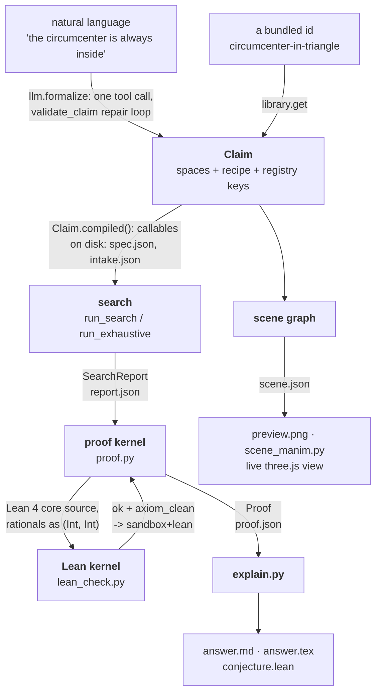
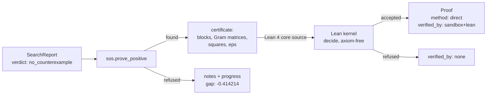
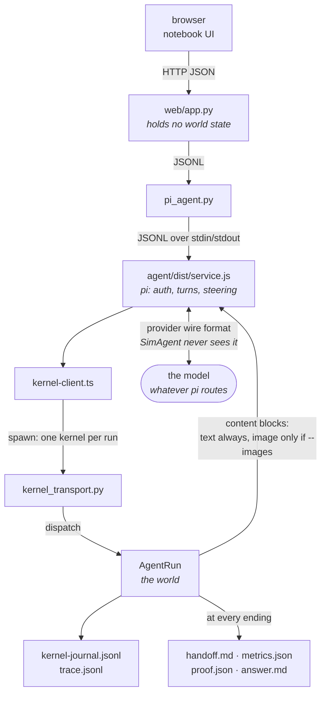
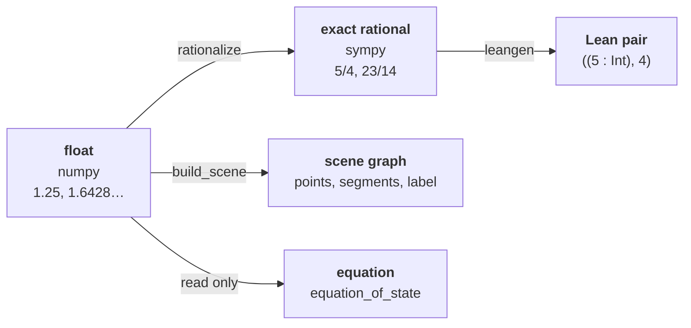
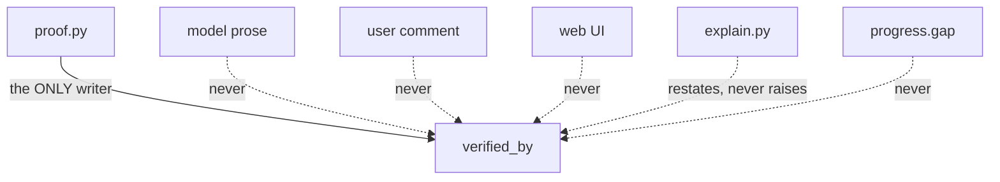

# End to end: what flows, and in what format

This page follows one conjecture from the words you type to the verdict on
disk, and names the FORMAT on every boundary it crosses.

It exists because a boundary nobody can name is a boundary nobody can test.
Each arrow below is a place where a weaker representation could quietly replace
a stronger one: a float where a fraction was required, prose where a kernel
stamp was required. Naming the formats is what makes that visible.

Every value quoted here is real output, from
`runs/sum-of-squares-vs-linear-seed0` (a false claim, settled by a
counterexample) and `runs/positive-quadratic-seed0` (its true twin, settled by
a certificate).

- [Path A: a batch run](#path-a-a-batch-run) - `simagent solve`
- [Path B: an agent run](#path-b-an-agent-run) - `simagent agent`, four processes
- [One state, five representations](#one-state-five-representations)
- [Where a verdict can and cannot come from](#where-a-verdict-can-and-cannot-come-from)

---

## Path A: a batch run

One process, no model in the loop after formalization.



### What travels on each boundary

| # | Boundary | Format | Real value |
|---|---|---|---|
| 1 | words → Claim | `claim/1` JSON: `format, id, title, conjecture, latex, quantifier, spaces, recipe, measure, constraint, certify, lean, scene, assume, lean_statement, notes` | `measure: {"kind": "expr", "margin": "P[0]**2 + P[1]**2 + 1 - 2*P[0] - 2*P[1]"}` |
| 2 | Claim → contract | `intake/1` JSON: `source_text, source_kind, formalizer, claim_hash, validation, review_state, approved_hash, description[]` | `claim_hash: "acbe0b3ce47d…"`, `review_state: "not-required"` |
| 3 | Claim → search | Python callables from `Claim.compiled()`, never source text | `comp.check(P=array([1.25, 1.6428571428571428]))` |
| 4 | one probe → the loop | `CheckResult` as `{holds: bool, margin: float, data: dict}` | `{"holds": false, "margin": -0.5242346938775517, "data": {}}` |
| 5 | search → proof kernel | `SearchReport`: `verdict, certified, trials, valid_trials, refine_steps, seed, witness, witness_check, exact_witness, margin_min, margin_max, notes` | `witness: {"P": [1.25, 1.6428571428571428]}` and `exact_witness: {"P": [["5/4", "23/14"]]}` |
| 6 | proof kernel → disk | `Proof`: `method, claim, verified_by, argument, witness, lean_file, lean_report, statement_review` | `method: "counterexample"`, `verified_by: "sandbox+lean"` |
| 7 | proof kernel → Lean | Lean 4 core source; every rational an `(Int, Int)` pair with `q > 0` asserted | `def P_0 : Q := ((5 : Int), 4)` |
| 8 | Lean → stamp | `lean_report`: `{available, ok, axiom_clean, isolated, output}` | `output: "'sum_of_squares_vs_linear_disproof_witness' does not depend on any axioms"` |
| 9 | state → picture | `scene.json`: a LIST of primitives, each a dict with `type` (`points`, `segments`, `label`) plus its own fields | `{"type": "points", "coords": [[1.25, 1.6428571428571428, 0.0]], "color": "#c8890a", "radius": 0.06, "name": "P", "binds": null}` |
| 10 | everything → the human | Markdown and LaTeX written from kernel state only | "DISPROVED — certified counterexample (exact rational arithmetic)" |

Two things in that table carry the weight.

**Row 5 carries the witness twice.** Once as floats, once as fraction strings.
The float is what search found; the fractions are what a verdict may rest on.
Nothing downstream of row 5 reads the float, which is how "certified in exact
arithmetic" stays true rather than becoming a phrase.

**Rows 6 to 8 are the only place `verified_by` is written.** One producer, one
file. That is what makes the stamp auditable at all.

A run that reaches only row 5 still writes rows 9 and 10. It says
`verified_by: none` and calls itself evidence. That is an honest ending, not a
missing one.

### The proving branch of the same diagram

When the claim is TRUE, search cannot settle it: no number of good samples
proves a `forall`. The kernel takes a different road to the same Lean check.



| Boundary | Format | Real value |
|---|---|---|
| search → SOS | `margin_min` as an eps hint, plus the claim's `assume` list as constraint polynomials | `sp.Rational(margin_min).limit_denominator(64) / 2` |
| SOS → Lean | blocks of `{basis, G, gmons, gcoef, ds, vs}` in `(Int, Int)` rationals | `ds := [((43 : Int), 58), ((57 : Int), 86), ((28 : Int), 57)]` |
| SOS → the caller (found) | the identity, printable as mathematics | `margin - (15/58) = (43/58)*(-29*P_0/43 - 29*P_1/43 + 1)**2 + (57/86)*(-29*P_0/57 + P_1)**2 + (28/57)*(P_0)**2` |
| SOS → the caller (refused) | `notes` (words) and `progress` `{gap, eps, candidates}` | `gap: -0.4142135623730955` |

`gap` is the proving side's margin: how far the closest candidate Gram matrix
stood from positive semidefinite, and exactly `0.0` once the exact split accepts
one. It is perception, never a verdict. A claim that misses by `-3.3e-05` is
still false.

---

## Path B: an agent run

The same kernel, reached through four processes, with a model in the middle.
The last hop lands back in Python, which is the trust argument in one line:
**the model is in the middle of the chain, never at the end of it.**



### The wire, hop by hop

| Hop | Carries | Format |
|---|---|---|
| browser → `web/app.py` | a problem id or free text, a comment, a branch point, a picked 3D point | HTTP JSON |
| `pi_agent.py` → `service.js` | run lifecycle and human moves | JSONL `{"id","op",…}` |
| `service.js` → model | system prompt, task prompt, the 21 tool schemas | pi's provider adapter; SimAgent never sees a provider wire format |
| model → `kernel_transport.py` | one tool call per turn | `{"op":"call","toolCallId","name","args"}` |
| `AgentRun` → model | the tool result | a `_fit`ted JSON string, or a content-block list |
| `AgentRun` → disk | the replayable world, and the readable one | `kernel-journal.jsonl`, `trace.jsonl` |

**One envelope, both JSONL hops.** `web/app.py → service.js` and
`kernel-client.ts → kernel_transport.py` speak the same shape, which is why a
failure at either hop reads the same way:

```json
{"id": "py-7", "op": "call", "toolCallId": "call-7",
 "name": "nudge", "args": {"name": "T", "row": 3, "delta": [0, 0, -0.5]}}
```

```json
{"id": "py-7", "ok": true,  "result": {}}
{"id": "py-7", "ok": false, "error": {"type": "ValueError", "message": "…"}}
```

Kernel ops: `describe`, `call`, `userAction`, `note`, `runtime`, `annotate`,
`snapshot`, `stop`, `finalize`. One request, one response, always.

Service ops: `start`, `status`, `events`, `comment`, `pause`, `resume`,
`userAction`, `branch`, `stop`, `structured`, `models`.

### What the model actually reads back

Real output of `set_var T [-1,0,1,0,0,0.5]` on `circumcenter-in-triangle`:

```json
{"config": {"T": [[-1.0, 0.0], [1.0, 0.0], [0.0, 0.5]]},
 "holds": false, "margin": -1.5,
 "data": {"circumcenter": [0.0, -0.75], "barycentric": [1.25, 1.25, -1.5]}}
```

Two rules shape that payload:

- `_status` sends the free coordinates WITH the margin. Without them the model
  can read its score but not where its own points are, and every deliberate
  move becomes a guess.
- `_fit` drops WHOLE fields when a result is too long, and names them
  (`truncated: true`, `dropped_fields: [...]`). A reply cut mid-value would
  read as a complete one.

### The journal: one line per event, append-only

| `event` | Written when | Key fields |
|---|---|---|
| `header` | the run opens | `version` (4), `specId`, `seed`, `state`, `stateHash`, `provenance` |
| `note` | the model thinks | `seq`, `kind`, `text`, `stateHash`, `traceStep` |
| `call` | a tool runs | `seq`, `toolCallId`, `tool`, `args`, `result`, `isError`, `finished`, `state`, `stateHash` |
| `user_action` | a human moves the world | same shape as `call`, limited to sample/set_var/nudge/construct |
| `annotation` | a comment, or branch provenance | `kind` (`user_comment`, `provenance`), `payload`; asserts the hash is UNCHANGED |
| `adopt` | a finished run is re-opened | the earlier journal, and the ending it cleared |
| `stop`, `end` | the run closes | `summary`, final state |

`stateHash` is `sha256` of the canonical JSON (`sort_keys`, no spaces) of the
kernel state: spec, world entities and values, vars, check, RNG state, hunt
seed, reports, declared plans, open and scored expectations, artifact counters,
deductive proof, and the finished/stop/summary flags. Narrative is deliberately
outside it.

That hash is what makes branching and adopting honest. Replay recomputes every
step and refuses unless each hash matches, so continuing a run cannot invent
state that nobody executed.

### What every ending leaves

`metrics/1`, counted off this run's own trace:

```
format, spec, seed, images, provider, model, thinking, ended_by,
turns, tool_calls, tool_errors, human_interventions, user_comments,
by_tool, refusals, predictions, constructions, verified_by, verdict,
certified, inherited_steps, adopted_from
```

Downstream readers (`evaluate.py`, `rounds.py`) read this file rather than
recounting the journal, because two counters over one journal are two numbers
that can disagree.

Counts are of THIS run's own acts. An adopted run replays earlier acts into its
own journal, and crediting them would report a round that did nothing as a
forty-turn round.

---

## One state, five representations

The same configuration is rewritten at each stage. Each rewrite buys exactly
one thing.



| Representation | Buys | Can it settle a claim |
|---|---|---|
| float (numpy) | speed, so search can try thousands of configurations | No. It can only ever PROPOSE |
| exact rational (sympy) | a verdict independent of floating point | Yes: `sandbox` |
| Lean integer pairs | a verdict independent of this codebase | Yes: `sandbox+lean` |
| scene graph | perception, feeding mpl, Manim and three.js from one source | No. Pictures explain, never prove |
| equation | a reading of the world for the human | No. Symbols follow the world, never the reverse |

---

## Where a verdict can and cannot come from



The dotted arrows are the rule, not a diagram convention: every one of them is
a path that exists in the code and is blocked on purpose. A comment enters the
run as steering and is journaled as `user_comment`; it cannot alter proof
state. `explain.py` may restate a stamp in English, including saying in words
that nothing checked a result. The notebook's verdict cell reads `proof.json`
and `answer.md`, never the model's narrative.

## See also

- [ARCHITECTURE.md](../ARCHITECTURE.md) - the kernel design and the rules a contributor must not break
- [onboarding/03-how-it-works.md](onboarding/03-how-it-works.md) - the same pipeline explained for a newcomer, with no formats
- [onboarding/05-glossary.md](onboarding/05-glossary.md) - every term used here in its own way
