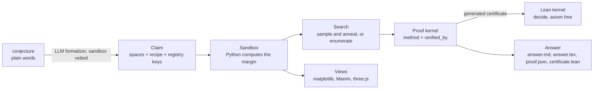

# How it works

This page follows one conjecture from words to verdict, then names the parts.

## The pipeline



## Step 1: the conjecture becomes a Claim

A Claim is data, never code. It names the free variables and their spaces, a
recipe of constructions, and one distinguished measure that produces the margin.
Every piece is a key into a closed registry:

| Registry | Holds | Example keys |
|---|---|---|
| `MEASURES` | How the margin is computed | `expr`, `min_coord`, `sum_odds_square`, `euler_characteristic` |
| `CONSTRAINTS` | Which configurations count as valid | `min_volume`, `hull_valid`, `expr_nonneg` |
| `CERTIFIERS` | The exact fraction mirror of a measure | `expr`, `simplex_inside` |
| `LEANS` | How to write the Lean certificate | `expr`, `recipe`, `simplex`, `bounded_nat` |
| `SCENES` | How to draw the state | `simplex`, `hull3d`, `graph`, `point`, `gnomon` |
| `CONSTRUCTORS` | The geometry kit for recipes | `circumcenter`, `centroid`, `midpoint`, `orthocenter`, `incenter`, `barycentric`, `dot`, `cross2`, `reflect`, `degrees`, ... |

Two consequences fall out of this design. First, **no generated code is ever
executed**. An LLM cannot hand this system a Python string to run, only a
selection from a menu. Second, the menu the model sees is generated from those
registries' `doc` strings, so adding vocabulary and documenting it are the same
act.

The general purpose entry is `expr`. It is one safe arithmetic AST, a whitelist
with no `eval`, driving three evaluators from one source: float for search,
exact sympy for certification, Lean rational terms for the certificate. Any
rational inequality over a box is therefore expressible with no new code. That
is why `positive-quadratic` and `conditional-cubic` needed no new machinery.

Claims are validated before they are accepted. `validate_claim()` in
[`core/claim.py`](../../src/simagent/core/claim.py) is the gate for anything an
LLM produces, and it rejects a certifier or Lean hook whose margin is not the
measure's margin exactly.

## Step 2: the margin, and why the sign is everything

The measure returns one float. The convention is fixed across the whole
codebase:

> **margin > 0 means the property holds. margin < 0 means it fails.**

Because it is continuous, search has a gradient to follow. For a `forall` claim
the search *minimizes* the margin, hunting for a counterexample. For an `exists`
claim it *maximizes*, hunting for a witness. The zero level of that number is
the boundary of the theorem, which is why the `field` view is more than
decoration: painting the margin over a slice of configuration space and drawing
its zero contour shows you the shape of the theorem. For the triangle claim,
that contour is literally the Thales circle.

## Step 3: search

Two engines, in [`search.py`](../../src/simagent/search.py):

- **`run_search`** for continuous domains. Random sampling, then margin guided
  annealing (perturb, keep the move if the margin improved), then rationalize
  the winner to small denominators and re-check it in exact arithmetic.
- **`run_exhaustive`** for finite integer domains. Every case, no sampling.

`run_exhaustive` fails closed on purpose. A case whose check raises makes the
whole verdict incomplete rather than passing quietly. Empty or inverted domains
are rejected. Certification requires either an exact certifier or a domain whose
integers are provably exact in float64.

## Step 4: the proof kernel

[`proof.py`](../../src/simagent/proof.py) is the only module in the repository
allowed to write a `verified_by` stamp. It knows ten classical proof methods.

| Method | Who can verify it here |
|---|---|
| counterexample | Harness in exact fractions, plus a Lean certificate |
| construction | Same machinery, for existence witnesses |
| exhaustion | Every case of a finite integer domain, plus Lean `decide` |
| direct, contradiction, contrapositive, induction, cases, combinatorial, infinite descent | Lean only |

The split is the point. The harness can mechanize three of the ten. For the
other seven it grades nothing. An argument in prose, however good, is recorded
as `verified_by: none` until the Lean kernel accepts it.

One family of proofs is worth knowing, because search alone can never reach it.
Search can refute a `forall`, by finding one bad case, but it can never establish
one. `sos_proof()` is the way in: it certifies the margin as a sum of squares,
which makes positivity self evident. Being deductive, it returns nothing unless
Lean accepts the certificate, and it demands a *strict* certificate, because
proving `margin >= 0` does not settle a strict claim.

Two more instruments build on that same machinery. `cases_proof()` splits one
coordinate at a value the model chooses and certifies both halves.
`induction_proof()` handles an unbounded claim over the naturals: the base case
is positive, and the step increase `margin(n+1) - margin(n)` is a sum of squares,
so the margin never decreases. That last one reaches a statement no amount of
enumeration could, which is the point of having it.

## Step 5: the trust ladder

Strongest to weakest. The harness never rounds up.

| Stamp | Meaning |
|---|---|
| `sandbox+lean` | Checked mechanically by the harness **and** re-proved by a generated Lean 4 core certificate the kernel accepts with no axioms. Independent of Python, sympy, and this codebase |
| `sandbox` | Complete mechanical check: exact fractions, or full enumeration of a finite domain. Sound, but not independently checked |
| `lean` | A Lean proof written by a model or a human that the kernel accepted. The *statement's* faithfulness to the conjecture still needs human review |
| `none` | An argument or sampling data on record. Not a proof, and labeled as such |

**Trust is not the same as faithfulness.** A `sandbox+lean` stamp says the Lean
kernel accepted the arithmetic. It does not say the Lean theorem states your
conjecture. For a bundled claim the certificate is reviewed, so the record says
`statement_review = bundled-trusted`. For anything else, including everything an
LLM writes, it says `spec-generated-review-needed`, and that trust is decided by
object identity with the bundled registry, never by matching an id string.

## Step 6: the Lean certificates

Certificates target **Lean 4 core only**: no Mathlib, no Batteries, no lake
project. Checking is one `lean file.lean` process, and proofs are `by decide`,
which is pure kernel computation. That is what makes the axiom check meaningful.

Rationals are encoded as integer pairs `(p, q)` with `q > 0` asserted for every
atom. The arithmetic helpers multiply denominators, so positivity stays closed
under the operations, and cross multiplied comparisons then agree with `=` and
`<` on the rationals. That short closure argument is the entire trusted modeling
step. Everything after it is kernel checked arithmetic on explicit numerals.

The checker does not trust its own input, because the source is spec controlled.
It rejects unless all of these hold: no `sorry`, `admit`, `sorryAx`, or
`native_decide` token with comments stripped first; a clean exit with no sorry
warning; at least one `#print axioms` in the source, with Lean reporting *each
named theorem* axiom free **by name**; and no `depends on axioms` line anywhere.
Binding the check to theorem names is what stops a source from echoing the clean
phrase to spoof it.

Two limits, both stated in the output rather than hidden.

The first is dimension. The simplex certificate generator is capped at
dimension 3, which is why `circumcenter-in-4simplex` in R^4 stops at `sandbox`.

The second is subtle and worth understanding, because it shows how the project
thinks. Lean takes only *free* variables as atoms. A margin computed from a
*derived* entity, such as the orthocenter of a triangle, would enter Lean as a
bare number, and checking a bare number proves nothing about how that number was
built. So the `recipe` certificate **pins** every construction to its defining
equations, and the kernel then verifies the construction itself, not just the
arithmetic. Five constructors carry pins today: `circumcenter`, `orthocenter`,
`barycentric`, `centroid`, and `midpoint`. A recipe using any constructor
without a pin raises, on purpose, and the claim keeps its `sandbox` stamp rather
than quietly accepting a weaker certificate.

## The same state, written four ways

Nothing above keeps a second version of the truth. One configuration is
rewritten at each stage, and each rewriting buys exactly one thing.

| Form | Where it is used | What it buys |
|---|---|---|
| Floating point, numpy | Sampling and annealing | Speed. A float can only ever *propose* a candidate, which is why search on its own proves nothing |
| Exact fractions, sympy | `certify` | A verdict that does not depend on floating point. This is the `sandbox` rung |
| Integer pairs, Lean | The certificate | A verdict that does not depend on this codebase at all. This is the `sandbox+lean` rung |
| The scene graph | Every picture | Perception. matplotlib, Manim and the browser read the same JSON, so the human views one kernel state. An image-channel run also sends tool pictures from that state to the model |

There is a fifth form, and it is for reading only. `equation_of_state()` in
[`core/journal.py`](../../src/simagent/core/journal.py) turns the current state
into equations for the trace, and nothing flows back from it into the world.
That direction is the project's thesis in one line: the executable state is the
working object, and the symbols are its record.

## The eight atoms

Everything above composes from eight primitives. Seven live in
[`src/simagent/core/`](../../src/simagent/core/) and the eighth,
View, lives in [`src/simagent/views/`](../../src/simagent/views/).

| Atom | Physical analogy | Role |
|---|---|---|
| **Space** | Configuration space | The input boundary: sample, validate, perturb, exact, enumerate. Today: `Box` in R^d, `IntBox` in Z^d, `GraphSpace` |
| **Entity** | Particle | A named thing. Either *free*, a value in a Space, or *derived*, a recipe over other entities |
| **Op** | Force | The only channel that mutates the world. This is also the agent's action vocabulary |
| **Derive** | Physical law | The dependency graph. Derived entities recompute when their ancestors move |
| **Measure** | Observable | Perception as calibrated compression: margins and qualitative words, never raw coordinate dumps |
| **Claim** | Hypothesis under test | Quantifier, free spaces, recipe, and one distinguished measure |
| **Journal** | Lab notebook | State equals replay of the journal. It is also the save format, the undo stack, and the notebook feed |
| **View** | Detector | The output boundary: `identity`, `field`, `sweep`, `trajectory`, `ghost` |

Dimension aware code exists **only** at the two boundaries, Space and View.
Everything in between, including search, certification, and the proof kernel, is
dimension blind. The bundled `circumcenter-in-4simplex` problem is the test of
that claim: it runs in R^4, produces a certified counterexample, and reports
`sandbox` with an explicit note that no Lean certificate exists above dimension
3.

Most named features are compositions of these atoms rather than new machinery:

```
sample   = Op(Space.sample)
refine   = loop { perturb, measure, keep if better }
hunt     = sample^n + refine
exhaust  = Space.enumerate_cases x Measure
certify  = Space.exact + exact Measure
construct= Op(add derived) + Derive
diff     = Journal[n] - Journal[n-1]
imagine  = Ops on a forked world, journaled as "imagine", never merged
expect   = a journal annotation, scored mechanically against later states
undo     = replay a journal prefix
```

## The responsibility split, one more time

```
LLM or human  reasons, conjectures, chooses the proof method, writes Lean
harness       executes, enumerates, certifies, kernel checks, keeps state
Lean kernel   the only authority on deductive truth
```

The UIs, the web notebook, the terminal REPL, and the CLI, are thin shells. They
render state. They cannot mint a verdict.

There is a matching rule for anyone extending the harness: an instrument must
report its own limits, because a dead end with no reason is one the model cannot
act on, but it must never name the next method to try. Reporting a limit is
information. Naming the next move is steering, and steering is the reasoner's
job.

Next: [the notebook and agent mode](04-notebook-and-agent.md).
